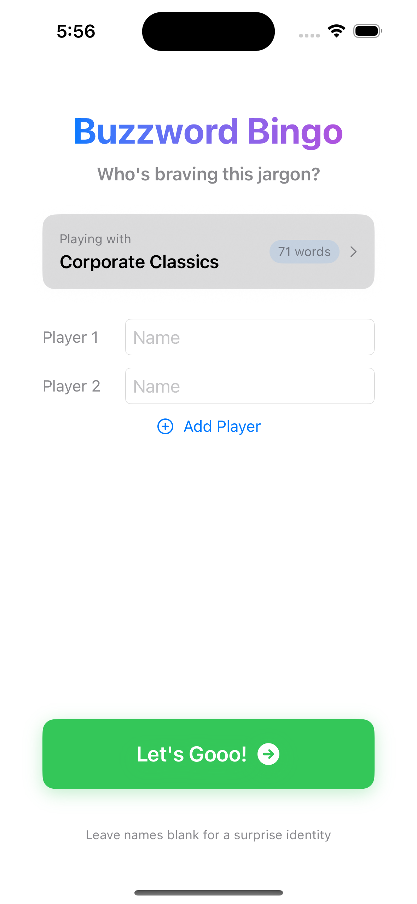
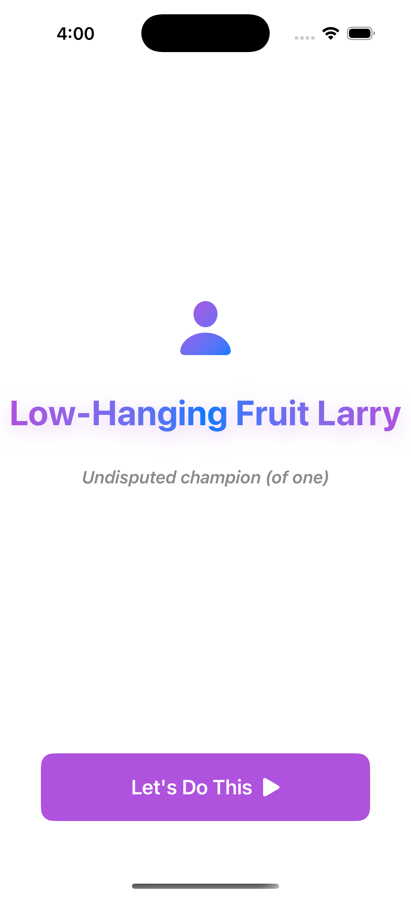
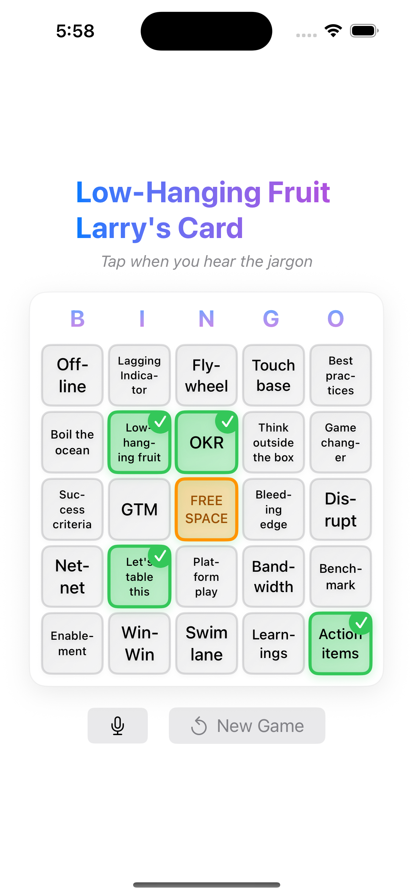

# Buzzword Bingo

[](https://github.com/mbarnson/buzzword_bingo/actions/workflows/build.yml)

A SwiftUI app for iOS and macOS that turns soul-crushing corporate meetings into a game. Tap squares when you hear buzzwords, or let the speech recognition do it for you while you zone out.

## Screenshots

<p align="center">
  
  
  
  
</p>

## Features

- **5x5 Bingo Grid** - Classic bingo gameplay with corporate buzzword squares
- **Pass-and-Play Multiplayer** - Take turns with coworkers (or play solo, we don't judge)
- **Speech Recognition** - Hands-free auto-marking using Apple's Speech framework. The app listens to your meeting and marks squares when it hears matching buzzwords
- **Semantic Matching** - Uses NLContextualEmbedding (BERT-based) to catch paraphrases. Says "end of day" when the square says "EOD"? Still counts
- **Custom Buzzword Lists** - Create and save your own lists for different meeting types (all-hands, sprint planning, investor calls, etc.)
- **Accessibility** - VoiceOver support, Dynamic Type, and reduced motion alternatives throughout

## Requirements

- iOS 18.0+ / macOS 15.0+
- Xcode 16.0+
- Swift 6.0

## Building

```bash
# macOS
xcodebuild -scheme "Buzzword Bingo" -destination "platform=macOS" build

# iOS Simulator
xcodebuild -scheme "Buzzword Bingo" -destination "platform=iOS Simulator,name=iPhone 16" build
```

Or just open `Buzzword Bingo.xcodeproj` in Xcode and hit Run.

## How It Works

1. Enter player names (1-8 players)
2. Pick a buzzword list or create your own
3. Start your meeting
4. Tap squares when you hear the buzzwords, or enable the microphone and let the app listen
5. First to get 5 in a row wins
6. Question whether this is a productive use of company time

## The Vibe-Coded Elephant in the Room

This app was built with Claude Code (Anthropic's AI coding assistant). The commit history has been squashed to hide the evidence, but the `CLAUDE.md` file remains as a testament to our collaborative shame.

Is it over-engineered? Probably. Does the semantic matcher use BERT embeddings for a bingo game? Yes. Was any of this necessary? Absolutely not.

## Privacy

This app requests two permissions when you enable speech recognition:

- **Microphone Access** - To hear audio from your meeting
- **Speech Recognition** - To transcribe audio using Apple's on-device Speech framework

All processing happens locally on your device. No audio or transcripts are sent to external servers. The app doesn't record or store any audio - it just listens in real-time and forgets everything when you stop.

## License

[Unlicense](LICENSE) - Public domain. Do whatever you want with it. We accept no responsibility for any meetings made marginally more tolerable by this software.
